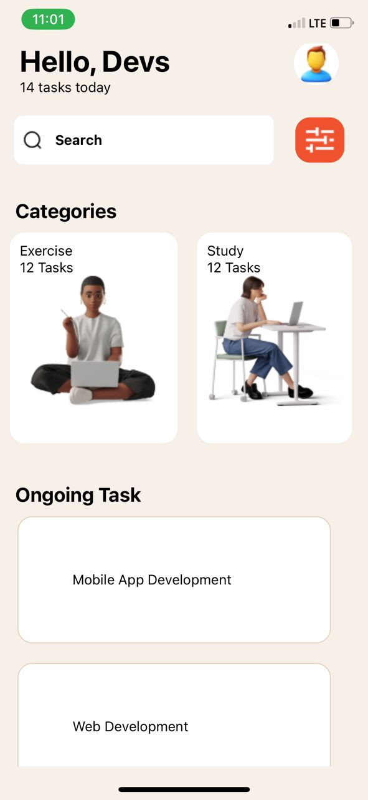
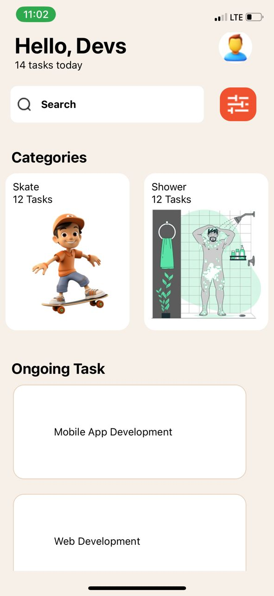
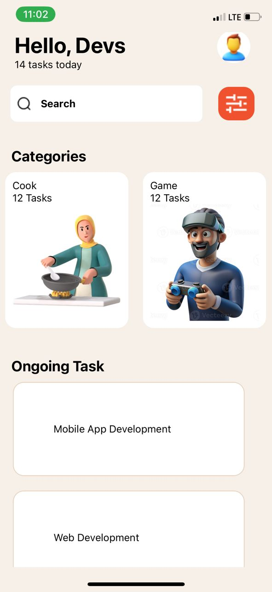
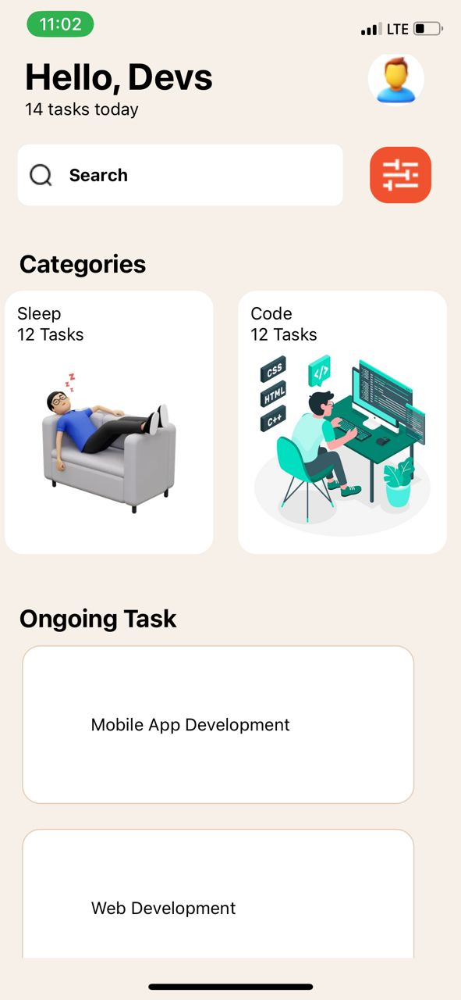
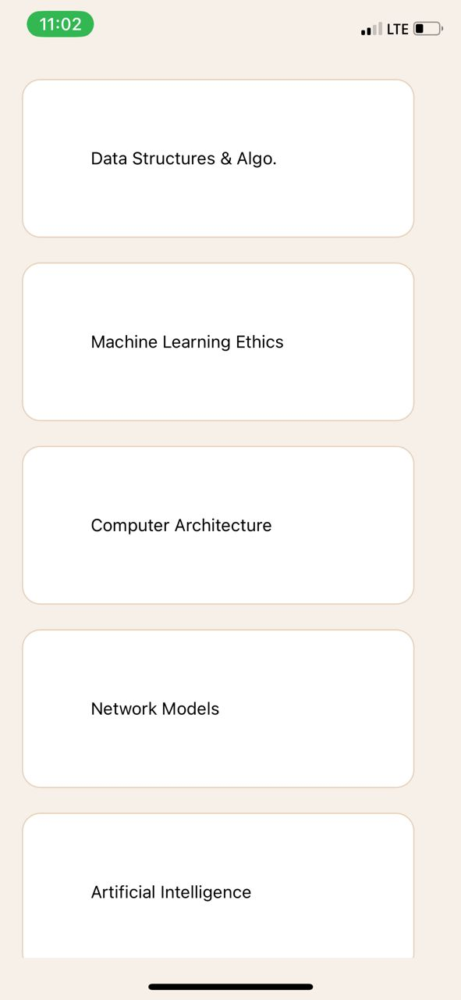
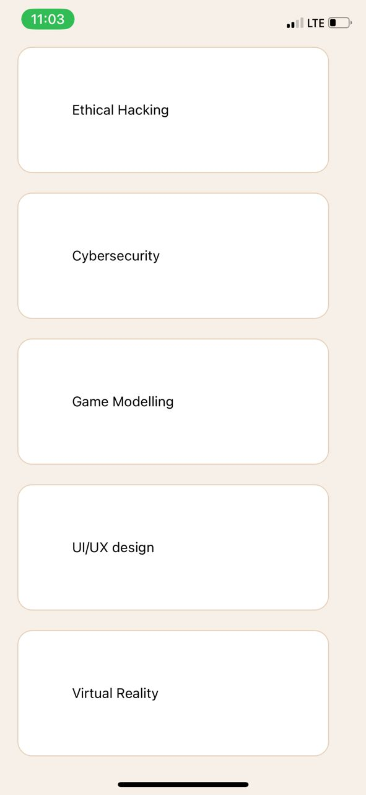
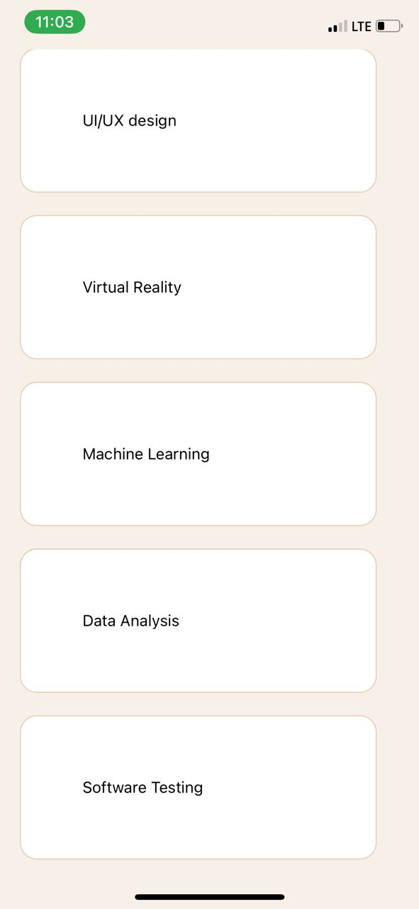

# 11020486 - To-Do App

This is a simple to-do application built with React Native. The app allows users to manage their tasks by categorizing them and viewing ongoing tasks. Below is a brief description of each component's usage.

## Components

### App.js
This is the main component that renders the entire application. It includes a `SafeAreaView` and `ScrollView` to ensure the app content is displayed correctly on different devices and allows scrolling.

### Header.js
This component displays a header with a greeting, the number of tasks for the day, and the user avatar.

### Categories.js
This component renders a search bar and a horizontal list of task categories using `ScrollView`. It includes various categories such as Exercise, Study, Code, Cook, Skate, Shower, Game, and sleep.

### OngoingTasks.js
This component displays a list of ongoing tasks using `FlatList`.

### Core Components Used:
- `View`: Used as a container for other components.
- `Text`: Displays text in the app.
- `ScrollView`: Allows for vertical and horizontal scrolling of content.
- `TextInput`: An input field for user text entry.
- `StyleSheet`: Creates a style sheet to style components.
- `Button`: Adds a clickable button (used in other potential actions not detailed in this file).
- `FlatList`: Renders a list of items efficiently.
- `Image`: Displays images, such as user avatars and category icons.

## Screenshots of the app on IPhone X using Expo go App

